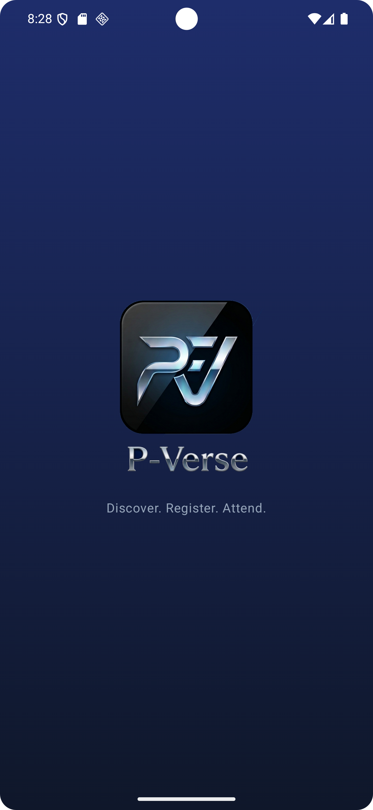
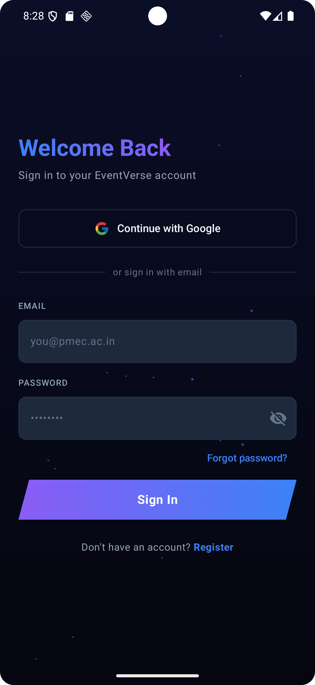
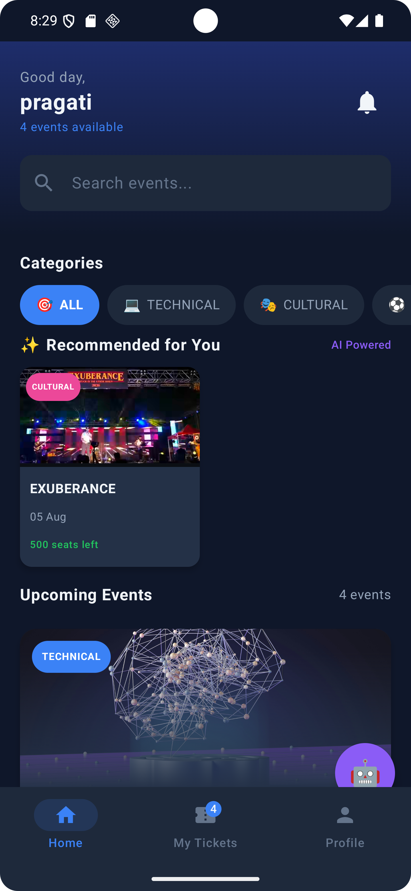
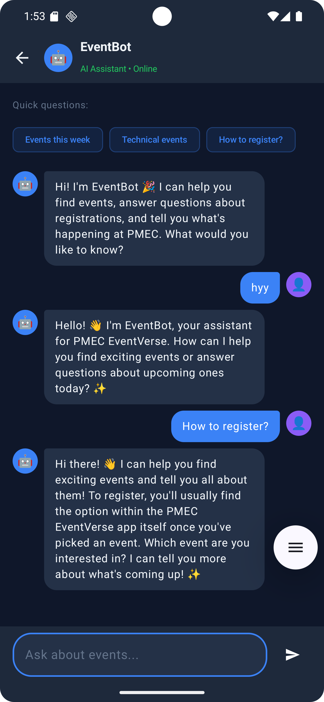
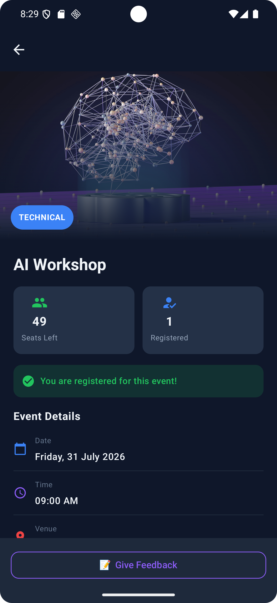
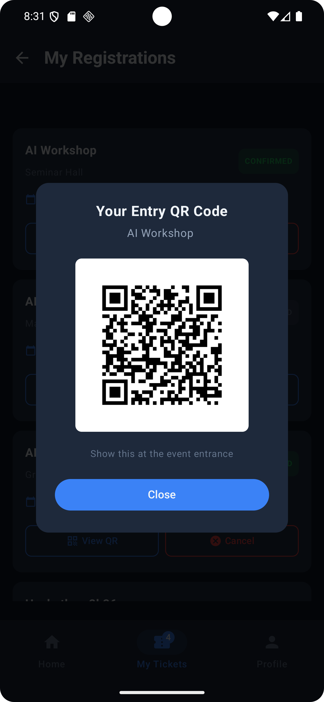
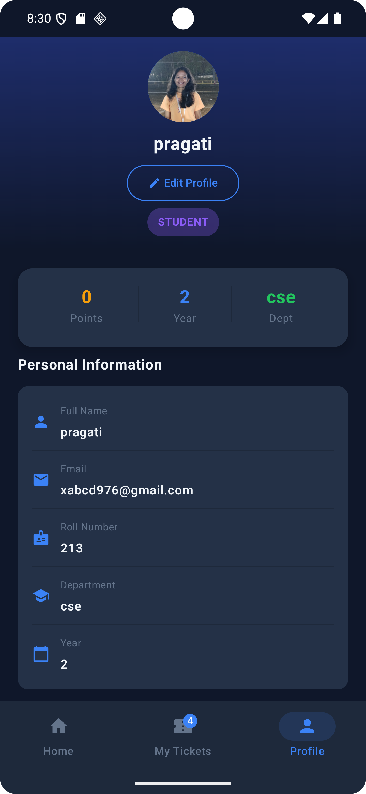
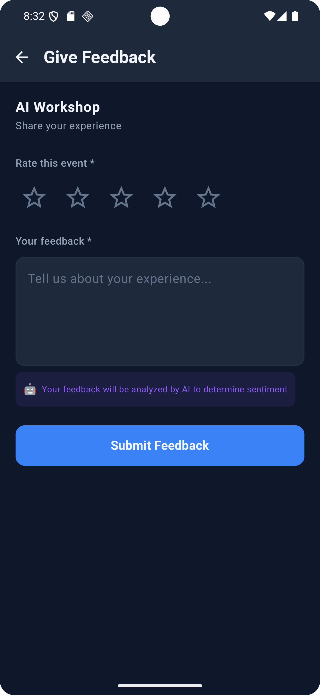

# PMEC EventVerse 🎓

A full-stack Android event management app built for Parala Maharaja Engineering College (PMEC), Odisha.

## 📱 Screenshots

  
  
  
  

  
  
  
  

## ✨ Features

### Student
- Browse and search upcoming events
- Register with QR code ticket generation
- AI-powered event recommendations
- EventBot AI chatbot (Gemini API)
- Give feedback with AI sentiment analysis
- View and manage registrations

### Organizer
- Create events with image upload (Cloudinary)
- QR code attendance scanner
- View feedback analytics with sentiment breakdown
- Edit and manage events

### Admin
- Approve/reject events
- View all events and registrations
- Analytics dashboard

## 🤖 AI Features
- **EventBot** — Gemini AI chatbot answering event queries in real-time
- **Smart Recommendations** — ML-based personalized event suggestions
- **Sentiment Analysis** — AI analyzes student feedback as POSITIVE/NEGATIVE/NEUTRAL

## 🛠️ Tech Stack

| Technology | Usage |
|---|---|
| Kotlin | Primary language |
| Jetpack Compose | Modern UI framework |
| Firebase Auth | Authentication |
| Firebase Firestore | Real-time database |
| Firebase Storage | File storage |
| Cloudinary | Event poster images |
| Gemini API | AI chatbot + sentiment analysis |
| ZXing | QR code generation & scanning |
| Coil | Image loading |
| Shimmer | Loading animations |

## 🏗️ Architecture
- MVVM Architecture
- Repository Pattern
- Clean separation of UI, ViewModel, Repository, Model layers

## 🚀 Getting Started

1. Clone the repo
2. Open in Android Studio

3. Add your `google-services.json` from Firebase Console

4. Add your Gemini API key in `GeminiRepository.kt` and `FeedbackRepository.kt`

5. Add your Cloudinary cloud name in `MainActivity.kt`

6. Run the app

## 📊 Project Stats
- 6 weeks of development
- 50+ Kotlin files
- 3 user roles
- 6+ AI/ML features
- Real Firebase backend

## 👩‍💻 Developer
**Pragati Rani Gouda**
- 2nd Year CSE, PMEC berhampur
- LinkedIn: https://www.linkedin.com/in/pragati-rani-gouda-8515aa326?utm_source=share_via&utm_content=profile&utm_medium=member_android
- GitHub: https://github.com/Pragati975

